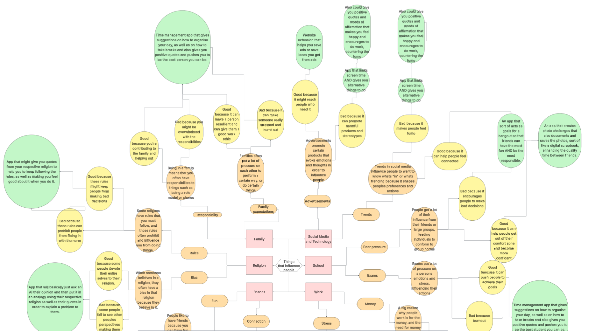
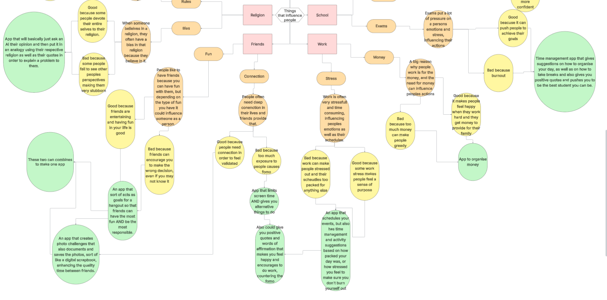
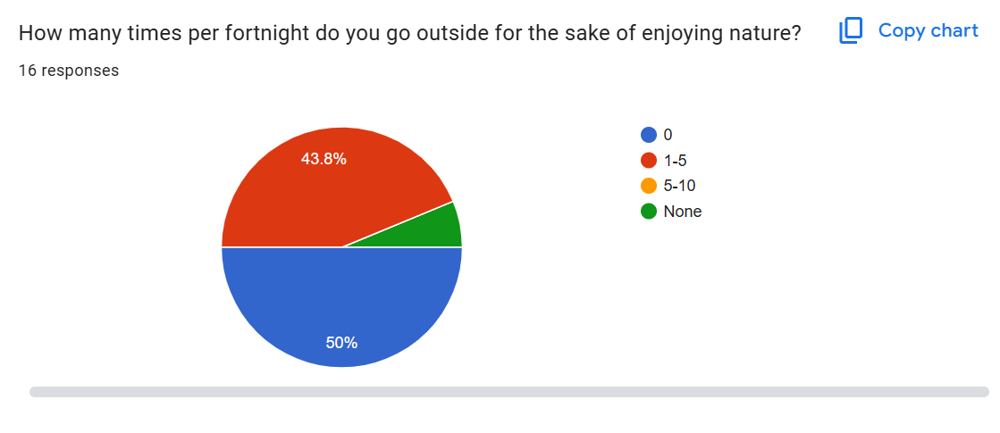
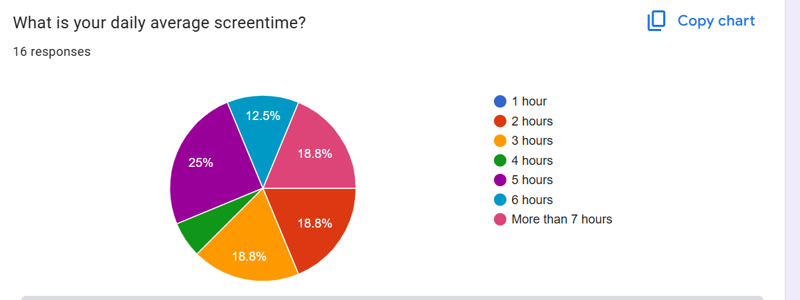
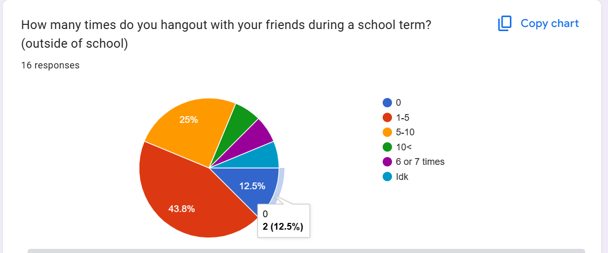
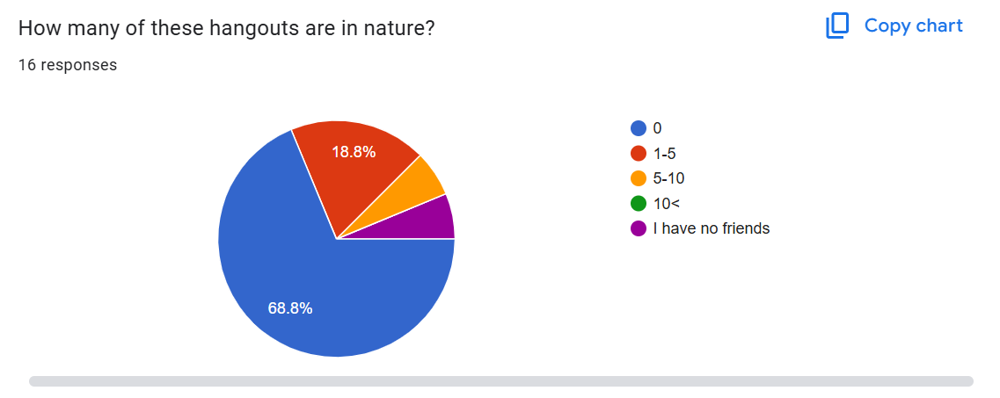
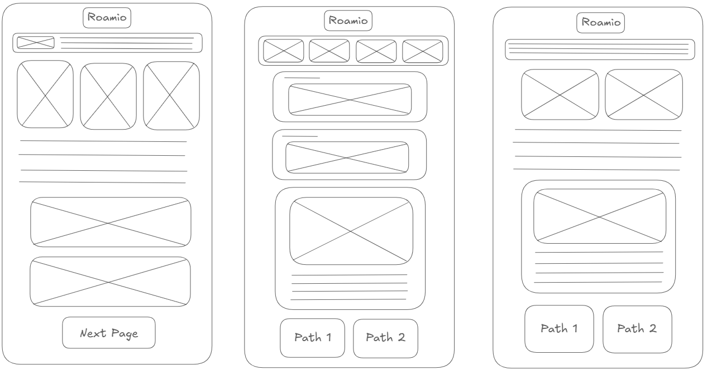

# **Assessment Task 2 - Web Application**
**By: Max Perez**

# Identifying and Defining 

## Divergent Thinking 

**Mind Map:**

If the images are too hard to see, you can look at the mindmap by clicking on this link: https://lucid.app/lucidchart/52b460d4-df14-43b8-9caa-d62634917599/edit?viewport_loc=-3581%2C-4450%2C10394%2C4994%2C0_0&invitationId=inv_d8b16e64-5beb-4541-aa58-86088eaafa69

## Convergent Thinking 

## Functional Requirements

- **Purpose of the Application** - The purpose of the application is to enhance the experience of a hangout with friends, whilst bringing them outdoors to reconnect with nature. This application will have a positive social impact on friend groups through an interactive "choose your own adventure" game, but with real life goals, thus bringing people together outside, allowing them to enjoy each others company in nature. 
- **Use Cases:** 
    - *Start Button* - Users will press the start button on the home page to bring them to the two paths page. 
    - *Choosing Initial Path* - Users can press on one of two buttons which, depending on what button they press, will take them to the respective path page.
    - *Previous and Next Stage Buttons* - Users can press previous or next stage buttons to go back and forth between different pages.
    - *Different Pathway Buttons* - Users can press on one of two buttons that will take them to different pages depending on what button they chose to press. 
    - *Photo Challenge Buttons* - Users can press on a button that reveals the photo challenge for their respective location. 
    - *Finish Trail Button* - Users will press the finish button when the trail has been completed.

- **Test Cases:**
    - *Start Button* - When the user presses on the start button on the home page, the web application will take the user to the two paths page. 
    - *Choosing Initial Path* - When the user presses on one of the initial paths, the web application will take the user to the resepective path page.
    - *Previous and Next Stage Buttons* - When the user presses on "previous stage" or "next stage" buttons, the web application will take the user to the previous page or to the next page of the pathway. 
    - *Different Pathway Buttons* - When the user presses on one of the different pathway buttons, the web application will take the user to a different pathway page. 
    - *Photo Challenge Buttons* - When the user presses on the "photo challenge' button, the web application will reveal a photo challenge that the user can copy with their friends in real life, as well as description of the photo. 
    - *Finish Trail Button* - When the user presses on the "finish trail" button, the web application will take the user to the final "congratulations" page.

## Non-Functional Requirements

- **Performance**
     - The website will deliver smooth, seamless transitions between pages, with minimal delay and with the highest quality possible. Furthermore, buttons will work within as little time as possible, to ensure that pages will run without distruptions. 
- **Usability** - The website will include features to maximise usability such as: 
    - *Consistent Layout*: Having a consistent layout will make it easy for people to learn and navigate the contents within the website.
    - *Colours*: Good colours will not only make the website aesthetically pleasing, but will also allow the users to navigate the website easily due to the contrast between colours. 
    - *Fonts*: Having readable fonts will ensure that the contents of the website is legible and easy to read, which is needed to maximise usability.
    - *Scaling and proportions*: In my website, the different icons and images will be properly scaled in order to have even proportions so that the website will be fully usable. 
    
- **Reliability** 
    - To ensure reliability, I will make sure to run tests that are both consistent in their manner and objective. My website is aimed to be accessed on phones as it's more practical to carry a phone with you on a hike compared to a laptop or another device, so tests will be run regarding to the layout of a phone. 
- **Security** 
    - The app will not be collecting any data. 

# Research and Planning 

## PMI Table

| Application |    Plus     | Minus       | Implication  |
| ----------- | ----------- | ------------|--------------|
| Instagram   | Instagram allows individuals to communicate with other people incredibly fast and very easily. The UI and UX are both very good as messages are easy to access and the whole platform looks aesthetically pleasing. There are also a variety of ways you can communicate different media to different people and that makes it a very versatile social media platform, making communication easier for millions of people around the world. | However, Instagram, although being very easy to use, can also be addicting. On the home page, there are so many different, distracting images, videos and audios, that effectively cause people to consume large amounts of media and content over long periods of time. Furthermore, the media on instagram doesn’t have much of a filter, and you could pretty much find anything and everything on instagram, even in the comment section.  |  Instagram is a good social media platform, allowing users to communicate with other people and express themselves in a plethora of ways effectively, however, due to the large amounts of media, it’s easy for people to lose track of time on instagram, possibly getting addicted, as well as being exposed to unwanted content. In my application, I will be sure to include a very easy and accessible UI, as well as making the entire platform aesthetically pleasing, however, my application will not include any media posting features as everything will just be for the user.  |
| Spotify     | Spotify allows individuals to access free music, audiobooks and podcasts that they can listen to and enjoy. The UI and UX are extremely good as everything is organised really well and the layout of everything is really aesthetically pleasing. All the buttons and features are really consistent, making it much easier to navigate. The premium version is also really good because it allows you to access media offline, and allows you to search up songs on your phone.| However, Spotify, especially the free version, is really annoying to use. On your phone, without premium, you can only access songs through playlists, as in you can’t search up a song and just listen to it. Moreover, you only have 6 advertisement skips, and after that you’ll have to deal with double unskippable ads. But on your laptop or desktop, you can access whatever songs you want, but there are still ads, and you still can’t access them offline. | Spotify, specifically premium, is a really good application to access different types of listening media, online or offline, with good quality and no ads. However, the free version is pretty bad as you have to experience ads, and on your phone there are other limitations that come with it. In my application I will make sure that my application is free, the UI is really easy to navigate and aesthetically pleasing, but will have to be online to work.       |
| Tripview    | Tripview is an app that allows individuals to plan their trip across many different ways of public transport such as trains, light rails, ferries and buses. Similar to the other apps, the UI and UX are pretty good and are also sleek, minimal and aesthetically pleasing. Moreover, the organisation of the different buttons within the app are also very good, also being colour coordinated, with good, clear, contrast between different buttons, but also possesses consistency within its UI, making it much easier to use. Furthermore, when online, tripview has real world data, meaning that you are updated on any delays that the public transport might have.  | Although tripview has a good UI and has certain features that make it easier to use, it also has a premium version, similar to spotify. The free version allows you to access the app like normal, with ads, however, it removes your search history, which makes it quite difficult to plan complex trips. Moreover, the sheer abundance of different locations you can travel can make it quite confusing for people travelling to somewhere new, as the locations don’t save.     | Tripview is a fantastic application to plan your trips, as it has vast amounts of information for different locations, however, the free version makes it really annoying and unnecessarily difficult to use, having to re-plan trips even if you use them everyday. In my application, I will make sure to include clear, concise and easily accessible and understandable information about the trip that people will go on, and I will also include proper images and apps to make it easier too. I also will ensure that my application is free and without ads. 
   |

## Secondary Research

For my secondary research, I am going to evaluate information from these websites; 

- https://www.redsearch.com.au/resources/phone-screen-time-statistics-australia-global/#:~:text=Screen%20Time%20by%20Age%20Group%20and%20Gender&text=Children%20(3%20to%2012%20years,)%3A%204.6%20hours%20a%20day. - Redsearch article, written by Daniel Law.
- https://www.sydney.edu.au/news-opinion/news/2025/08/04/more-than-40-percent-of-young-aussies-are-lonely-as-experts-call-for-national-loneliness-strategy.html#:~:text=more%20than%20two%20in%20five%20young%20Australians%20feel%20lonely,to%2017%2Dyear%2Dolds. - University of Sydney.
- https://health.ucdavis.edu/blog/cultivating-health/3-ways-getting-outside-into-nature-helps-improve-your-health/2023/05#:~:text=So%2C%20stepping%20outside%20can%20help,heart%20rate%20and%20blood%20pressure. - University of California. 

From these websites, I am able to draw several conclusions regarding the daily average screen time of teenagers, how much time people spend alone and the benefits of more exposure to nature.

According to the first article, written by Daniel Law, Australians spend more than six hours a day, on mobile phones alone, with teenagers (13-19 years) spending 7.5 hours on screens all together. This is almost half the amount of time most teenagers are awake, which is obviously a concern. High amounts of screen time may also lead to depression and anxiety among young people. 

Moreover, the dangers of high amounts of screentime also contribute to the recent increase in loneliness amongst young people. In a study done by the University of Sydney, 43% of people aged 15-25 feel lonely, in which lifestyle factors and relationships played a signficant role. To support this,  anecdotal evidence presented in the study, states that its critical for young people to connect with communities and friends, as it boosts morale in almost everything. 

Additionally, according to the University of California, there are actually several benefits of going outdoors in nature, with potential to combat the effects of high screen time and loneliness. Such benefits include relaxing your mind and reducing cortisol levels, relieving you of stress. Being in nature also reduces anxiety, which can be caused by excessive loneliness, and also helps you sleep at night, which is another consequence of high screen time. 

However, spending time in nature may help individuals cope with the effects of high screen time and loneliness, but it might not be the solution.

From the data I gathered from these websites, it supports the need for my application, the purpose of which is to get teenagers away from their screens and reconnect with each other and with nature. As proven by these websites, high screen time and lonliness are problems that are present all over the world, and plague individuals in ways that might be hard to cope with. However, through the assistance of my application, individuals can be encouraged to enjoy time with their friends in nature away from screens.

## Primary Research 

For primary research, I created a google form to collect quantitatve and qualitatve data, specifically regarding screen time, details of hangouts between friends, and the importance and appeal for nature. Collecting this type of data was important because it would give me an overview about the perspective of teenagers regarding their own opinions on nature. Moreover, I am able to gather a general understanding of the problem of at hand, and how effective my app will be against it, helping me to identify features that may specifically target the problem, allowing me to strengthen them. 

The app I aim to create is targetted to teens, so it would make sense for the target market to be teenagers around 14-16 years of age. 

To collect a small survey of the data required, I emailed a form to some of my friends, but also put it in the google classroom to collect data from people other than my friends. By having a wide variety of ages, genders, friend groups and general opinions, it increase the validity and accuracy of the investigation, as well as aiding me to identify any trends and/or outliers in the data. In total, there were 16 responses. 

The google form: https://forms.gle/LDkaKfafZSr8bqSP7

Some of the answers I collected were:

From this data, I was able to conclude that a more than half of the particpants had a screen time of at least 5 hours. Furthermore, around 60% of participants don't go out with their friends during the school term often, maybe only 1-5 times per term, or sometimes none at all. What makes it  worse is the fact that around 70% of the already limited hangouts aren't even in nature.

From these findings, I am able to conclude that teenagers are in dire need of proper, healthy exposure to nature, as well as more time away from screens. However, with the assistance of my application Roamio, the objective of helping teenagers reconnect with nature is entirely possible.

I will make sure to emphasise the importance of reconnecting with nature in the first place, as many of the participants noticed that they were not getting that much exposure to nature, despite knowing the benefits. However, by reassuring that nature is in fact worth the time, it will further convince teenagers to get outside away from their screens.

Moreover, this data also helped me to realise that my application would benefit on the emphasis of the benefit of getting off screens, because it looks like teenagers understand the benefits of going outside, but are oblivious to the detrimental impact that high amounts of screen time have.

## UI and UX Design

### Here are my wireframes:

### Here is my webpage story board:

### Follow this link to access my prototype:

https://sites.google.com/d/1AGKwtHMgwLMXM9vnXRhTsP1v8LmttNAa/p/1Vo7rizV2LG26rF4TdUmGgBPplFcEcihN/edit
 
# Producing and Implementing   

Throughout the creation of my web application, I made many different changes. With these changes, I documented them by committing to GitHub, which can be accessed in my repositry.

But to simplify, the first week of September, I did most of my theory, such as functional and non functional requirements. In the second week of September, I started making my prototypes and web application. In my third week I finished my web application. 

# Testing and Evaluating

## Peer Evaluation:

- Chris: UI is too basic and all of the code is too simple as well, next time make it more complex.
- Luca: Colours are nice and its very minimalistic and simplistic, but next time it should have more features like those drop down menus you planned.

In the future, I will work on my time management to help make my application have as many good functional features as it can. 

## Evaluation of Issues:

- Social: I wouldn't consider my application of have any social issues, in fact, it is an application to aid people to socialise more. Since my websites purpose is bringing people together, then my website has a relatively positive impact on society.
- Ethical: My application is very ethical, as the purpose of it is to bring people together, and reconnect with nature at the same time. There is nothing inherntly bad about any of these goals, and with that being said, my application is ethically responsible. 
- Legal Responsibilities: My application does not require data from the user, however, there is a very limited amount of information about the actual trails in the website, so if users were to soley rely on the application, some complications, such as getting lost, my arise. 

## Project Evaluation:

Roamio, my web application, has met the standard of which I hoped for. With saying this, there is room for improvement, even though it met all the requirements.

The application was able to meet most of the functional requirements, with all the functions such as buttons working perfectly. However, many of the features that I originally wanted, such as the drop down menus, were too difficult for me to understand. To compensate for this, I just added images into the website without having the drop down menu, but still having the same "find this object" goal in mind. 

Moreover, the application was able to meet all of the nonfunctional requirements, including being secure, because it didn't collect any data, having a consistent and aesthetically pleasing UI, and the transition between pages was also very seamless. 

In terms of my time management, it could've defintely improved. I over estimated my abilities in several aspects, and I didn't realise the severity of my situation. Next time I will ensure to make a schedule, instead of a to-do list for an assessment, because although it did help me a lot for priotitisng, it did not help with my time management. 

On the target market, I do believe it will have an overall positive impact on individuals and friendgroups, bringing people closer to each other whilst reconnecting with nature at the same time. 